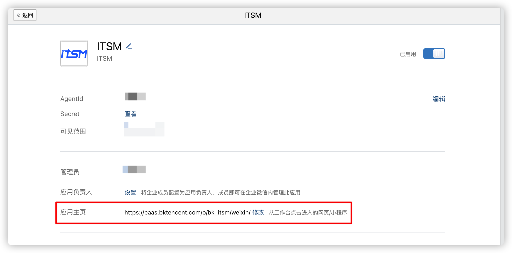

# 企业微信配置说明

## 一、企业微信配置说明

1. 设置企业微信应用的网页授权为 **外网域名**
    

2. 设置环境变量
    * `BKAPP_IS_QY_WEIXIN` : 1
    * `BKAPP_USE_WEIXIN` : 1
    * `BKAPP_WEIXIN_APP_ID` : 企业微信的CorpID
    
    * `BKAPP_WEIXIN_APP_SECRET` : 企业微信应用（任意）的Secret
    
    * `BKAPP_WEIXIN_APP_EXTERNAL_HOST` : **外网域名**

3. 需要确保应用服务器（appo/appt）能访问到微信API和企业微信API （可以只设置企业微信API的代理）
    * 微信提供的API协议均为https
    * 域名1: `api.weixin.qq.com`
    * 域名2: `qyapi.weixin.qq.com`

4. 反向代理，将应用外网域名的部分路径指向内网蓝鲸应用
    * 为了保证安全，必须只反方向代理部分路径
    * 应用正式环境反向代理: `/o/{bk_app_id}/weixin/和/o/{bk_app_id}/static/weixin/`
    * 应用测试环境反向代理: `/t/{bk_app_id}/weixin/和/t/{bk_app_id}/static/weixin/`
    * **header**必需配置 `X-Forwarded-Host` 为应用外网域名，**Host**为蓝鲸内网域名
    * **header**增加自定义配置 `X-Forwarded-Weixin-Host` 为应用外网域名，**Host**为蓝鲸内网域名
    * nginx反向代理示例参见下面

## 二、企业微信配置步骤

1. 配置代理

    ```
    server {
     # listen              80; # http填写80，https填写443 且https还得配置证书
     listen 443;
     ssl                 on;
     server_name         itsm.exter.com; # 填写应用外网域名
     charset             utf-8;
     access_log /var/log/nginx/itsm.log;
     ssl_certificate     itsm.crt;
     ssl_certificate_key itsm.key;
     ssl_session_timeout 10m;
     ssl_session_cache shared:SSL:1m;
     ssl_protocols TLSv1 TLSv1.1 TLSv1.2; #按照这个协议配置
     ssl_ciphers ECDHE-RSA-AES128-GCM-SHA256:HIGH:!aNULL:!MD5:!RC4:!DHE;#按照这个套件配置
     ssl_prefer_server_ciphers on;
     # root /data/itsm;
     # 假设bk_app_id = test_app，且配置应用的正式环境
     location ~ ^/(t|o)/itsm/weixin/ {
     proxy_set_header X-Forwarded-For $proxy_add_x_forwarded_for;
     proxy_set_header X-Real-IP $remote_addr;
     proxy_set_header X-Forwarded-Proto $scheme;
     proxy_set_header X-Forwarded-Host $http_host;
     proxy_set_header X-Forwarded-Weixin-Host itsm.exter.com; # 填写应用外网域名
     proxy_redirect off;
     proxy_read_timeout 180;
     proxy_pass https://paas.inner.com; # 蓝鲸的内网域名，需要dns能解析到，配置host会有问题
     }
     location ~ ^/(t|o)/itsm/static/weixin/ {
     proxy_set_header X-Forwarded-For $proxy_add_x_forwarded_for;
     proxy_set_header X-Real-IP $remote_addr;
     proxy_set_header X-Forwarded-Proto $scheme;
     proxy_set_header X-Forwarded-Host $http_host;
     proxy_redirect off;
     proxy_read_timeout 180;
     proxy_pass https://paas.inner.com; # 蓝鲸的内网域名，需要dns能解析到，配置host会有问
     }
     # 其他不做任何代理，直接返回404即可
     #location / {
     #        return 404;
     #}
     #location / {
     #        autoindex on; ##显示索引
     #        autoindex_exact_size on; ##显示大小
     #        autoindex_localtime on;   ##显示时间
     #        }
    }
    ```
2. 配置企业微信

    创建一个企业应用，并将应用的信息配置到蓝鲸ITSM的环境变量中，然后重新部署，最后配置企业应用的首页地址为蓝鲸ITSM的外网访问地址
    
    
    
    上面的变量对应企业微信应用的以下信息：
    

3. 绑定个人企业微信信息

    登录到蓝鲸个人中心，绑定企业微信，并**访问一次ITSM**

4. 访问ITSM

    打开蓝鲸ITSM，可以进行正常的提单操作

5. 访问企业微信中的ITSM应用

    进入企业微信，到工作台中找到你创建的企业应用，点击进入
